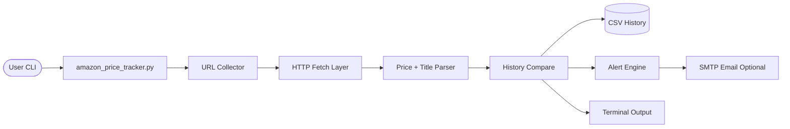

# Amazon Price Tracker CLI


> You should not manually recheck the same Amazon product every day.

**Amazon Price Tracker CLI** is a lightweight Python command-line tool that tracks Amazon product prices, stores history in CSV, and alerts you when a target or drop threshold is hit.

Built as a practical project for scraping workflows, CLI UX, and automation-friendly tooling.

---

## Demo Flow

```text
User runs command with one URL, urls file, or stdin list
                 ↓
Tool validates URL and extracts ASIN when available
                 ↓
Fetches product page (desktop + fallback strategy)
                 ↓
Parses product title + current price
                 ↓
Compares against last known price from CSV history
                 ↓
Prints result + triggers optional email alert rules
```

Example summary output:
- Current price and product name
- Last seen price with up/down/unchanged delta
- Success/failure totals for batch runs

---

## Architecture



---

## Tech Stack

| Layer | Technology | Why |
|---|---|---|
| Runtime | Python 3.8+ | Fast iteration and broad portability |
| Networking | requests | Reliable HTTP with simple API |
| HTML parsing | BeautifulSoup4 | Flexible selectors for price extraction |
| Config | python-dotenv | Clean local environment setup |
| Storage | CSV | Zero-infra price history persistence |
| Security | gitleaks (CI + pre-commit) | Prevent accidental secret leaks |

---

## Technical Highlights

**Batch-friendly input modes**: Accepts a single URL, `--urls-file`, environment fallback, interactive prompt, and stdin mode (`--urls-file -`) for shell pipelines.

**Defensive scraping strategy**: Tries desktop selectors first, then a mobile fallback request before failing, improving reliability across Amazon page variants.

**Stateful price movement tracking**: Uses ASIN (when present) as stable history key and shows price delta direction versus last run.

**Automation-safe exit codes**: Returns non-zero when all checks fail or no input is provided, which makes cron/CI integrations predictable.

**Configurable alerts**: Supports absolute target alerts (`--target`) and percentage drop alerts (`--drop-alert`) with optional email delivery.

---

## Getting Started

### Prerequisites

- Python 3.8+
- pip
- Optional: SMTP credentials for email alerts

### Install

```bash
git clone https://github.com/rrubayet321/Amazon-Price-Tracker-CLI.git
cd Amazon-Price-Tracker-CLI

python3 -m venv .venv
source .venv/bin/activate
pip install -r requirements.txt

cp .env.example .env
```

### Run

```bash
python amazon_price_tracker.py "https://www.amazon.com/dp/B0FM6C3ZMN"
```

---

## CLI Usage

```bash
python amazon_price_tracker.py [url] \
  [--urls-file FILE|-] \
  [--target PRICE] \
  [--drop-alert PERCENT] \
  [--history-file FILE] \
  [--name NAME] \
  [--dry-run-email] \
  [--no-prompt]
```

Examples:

```bash
# Single URL
python amazon_price_tracker.py "https://www.amazon.com/dp/B0FM6C3ZMN"

# Batch mode from file
python amazon_price_tracker.py --urls-file urls.txt

# Batch mode from stdin
cat urls.txt | python amazon_price_tracker.py --urls-file - --no-prompt

# Alert below target
python amazon_price_tracker.py "https://www.amazon.com/dp/B0FM6C3ZMN" --target 500

# Alert when dropped >= 5% since last run
python amazon_price_tracker.py "https://www.amazon.com/dp/B0FM6C3ZMN" --drop-alert 5
```

---

## URL File Format

`urls.txt` example:

```text
https://www.amazon.com/dp/B0FM6C3ZMN
https://www.amazon.com/gp/product/B0FM6C3ZMN
```

- One URL per line
- Lines starting with `#` are ignored
- Use `-` for `--urls-file` to read from stdin

---

## Environment Variables

Defined in `.env.example`:

- `AMAZON_URL`: default URL when no CLI URL is provided
- `TARGET_PRICE`: default target threshold (`0` disables)
- `DROP_ALERT_PERCENT`: default drop threshold (`0` disables)
- `PRICE_HISTORY_FILE`: CSV history output path
- `SMTP_ADDRESS`: SMTP host (default `smtp.gmail.com`)
- `EMAIL_ADDRESS`: sender/recipient address
- `EMAIL_PASSWORD`: app password for SMTP login

---

## Security Guardrails

- CI secret scanning runs on pushes and pull requests via GitHub Actions + gitleaks.
- Optional local secret scan before each commit:

```bash
pip install pre-commit
pre-commit install
pre-commit run --all-files
```

---

## Known Limitations

- Amazon anti-bot or regional variants can still block scraping for some products.
- CSS selectors may need updates when Amazon changes markup.
- CSV storage is local-file based and not multi-user by default.

---

## License

MIT

---

Built by [Rubayet Hassan](https://github.com/rrubayet321)
